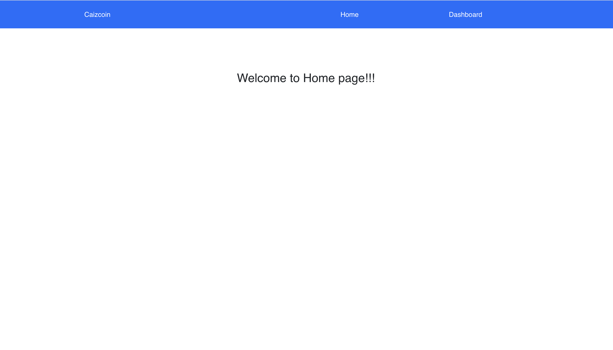
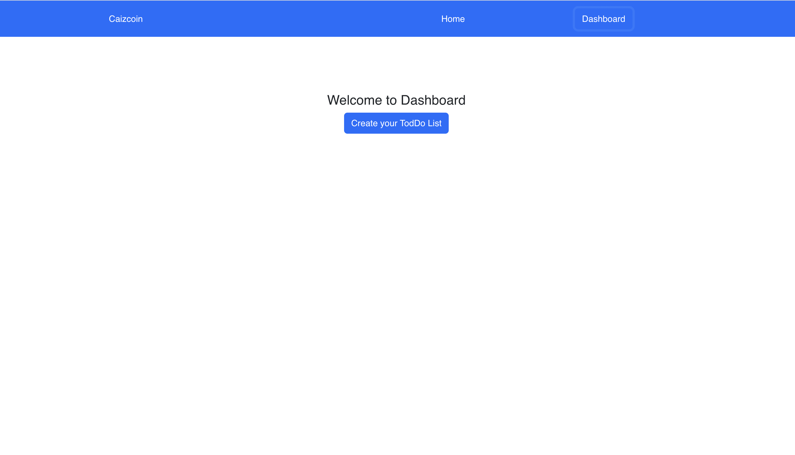
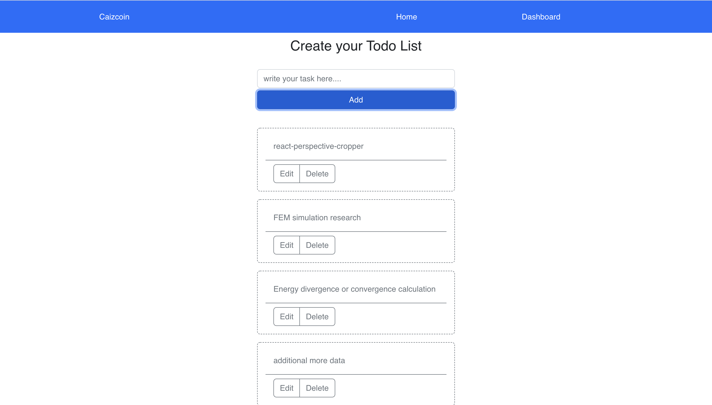
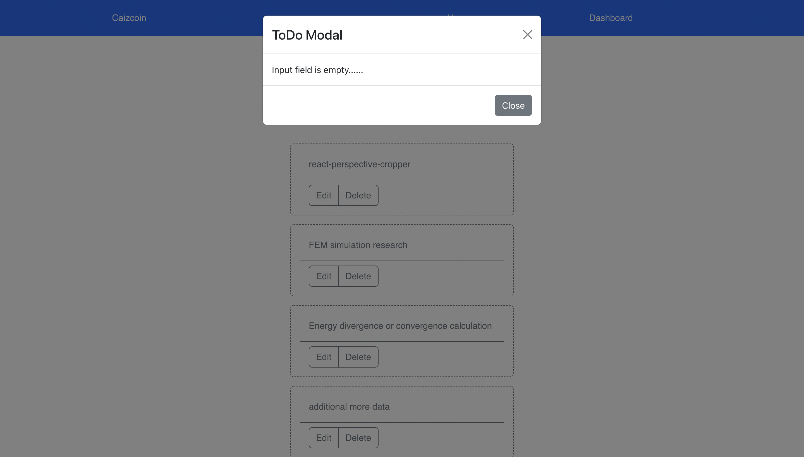

First install the `node modules` by run:

### `npm install`

Then run the project by

### `npm start`

Runs the app in the development mode.\
Open [http://localhost:3000](http://localhost:3000) to view it in your browser.

### Here are some screenshot

1. 
2.  
3. 
4. 

